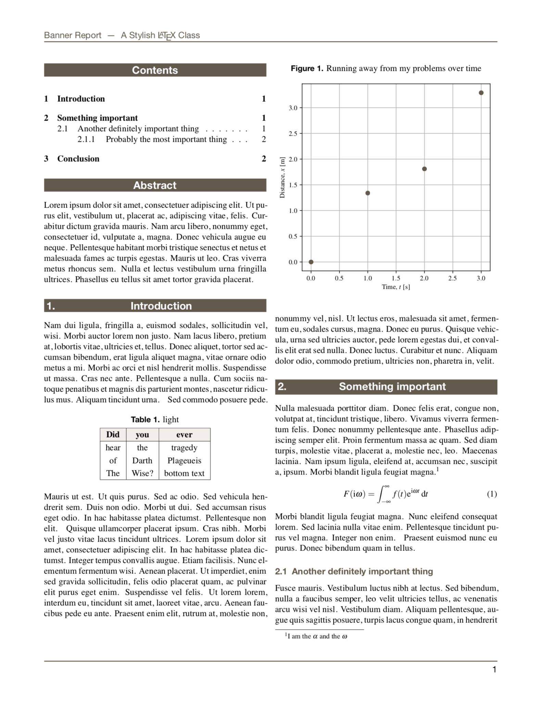

# Banner Report

A LaTeX class for a two column report with a fancy title page.


## Title page

Call the `\titlepage{banner.pdf}` command at the beginning of your document, but replace `banner.pdf` with the banner image you'd like to use. The file should be a 3.55 in × 9.6 in PDF. You may be able to use other image formats if the DPI information is embedded like it is for PDFs, but that behavior has not been tested.

You can fill in the other areas on the page with the following commands 

```latex
\title{Banner Report}
\subtitle{A Stylish \LaTeX Class}
\info{Sep 2019 \\ v0.8}
\author{ {\small prepared by} \\ Arya Daroui}
```

## Custom commands

### Environments

`dent`, `dent2{symbol}`, `code`,  `tableLight{caption}{colAlignment}`, `tableDark{caption}{colAlignment}`

### Macros

`fig{file.pdf}{caption}`, `plot{caption}{file.pdf}`





## Requirements

You will have to use XeLaTeX to typeset due to unicode support, and to avoid the annoying italic mu problem.

## To-do


- [x] Code listing style
- [x] Table style
- [x] Table of contents style

v1.0+

- [x] Adjustable colors
- [ ] auto reference compatibility à la BibTeX
- [ ] Make `tableDark` style auto color the header
- [ ] Fix spacing before and after code section
- [ ] Fix spacing before and after figures
- [ ] Choose cross-platform sans font because I forgot Windows doesn't have Helvetica (Neue)
- [ ] Intra-document bookmarks/links
- [x] Less finicky `dent` box
- [ ] Single column option
- [x] Figure macro
- [ ] Wide figure macro
- [ ] Prevent orphan columns 
